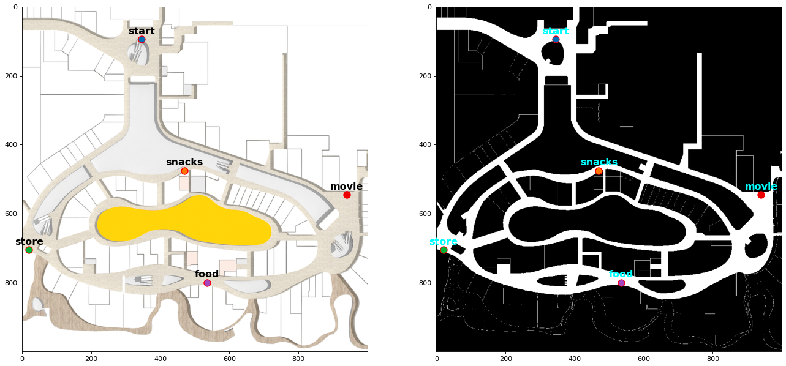
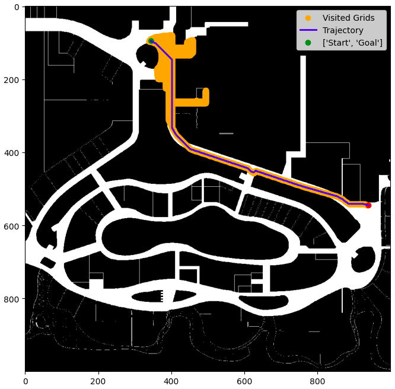
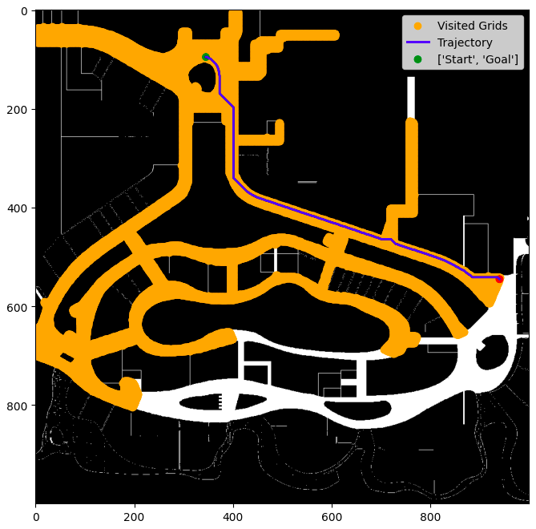

# Path Planning using A* and Dijkstra's Algorithm

## Overview :

A* and Dijkstra's algorithms have been implemented with Python3. For implementation and testing of both the algorithms, a map of Vivocity Mall Level 2 has been used. The original floor plan provided was converted into a greyscaled grid map which will be used by the planning algorithms. The map has a size of 1000 x 1000 pixels (grid cells), with each cell representing a 0.2m x 0.2m square area. Each grid cell belongs to one of the two possible states: Free (value **255**) or Occupied (value **0**). 

Five key locations have been provided. The goal is to find a path/trajectory between a pair of start and end locations using one of the graph search methods.

**Figure 1:** Original floor plan of Vivocity Level 2 (left). Greysacled grid map of the floor plan (right)

## Usage :

Run the **main.ipynb** Jupyter Notebook file to run the graph based planning algorithms. The default algorithm is A*. To run Dijkstra's algorithm, set `Astar=False` in the script. The five locations along with their coordinates are stored in the dictionary `locations`. 

## Results :

**Figure 2:** Path generated by A* algorithm between between **start** and **movie** location.

**Fiugure 3:** Path generated by Dijkstra's algorithm between **start** location and **movie** location.

It can be observed that A* algorithm is more efficient than the Dijkstra's algorithm. It explores fewer grid cells, resulting in lower computational costs and faster convergence, making it a more efficient pathfinding choice.