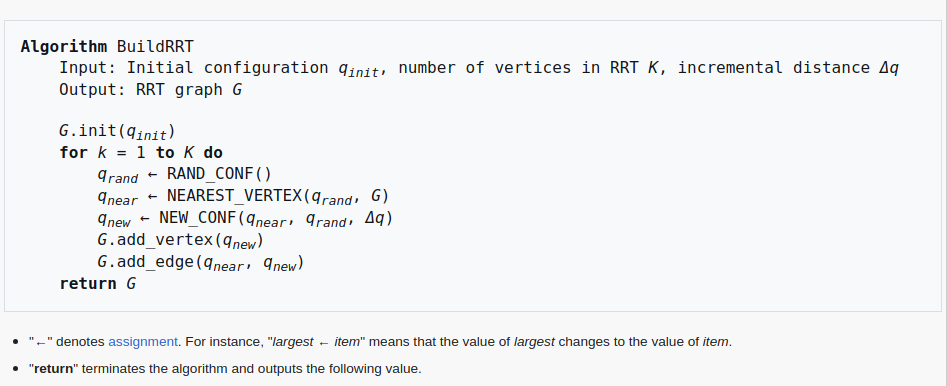

# Motion Planning 

## Overview :

The repository provides Python implementations of A*, Dijkstra's, and RRT algorithms. These are popular algorithms which are used in mobile robotics, aiding in pathfinding and navigation tasks. 

The repository semalessly integrates both Dijkstra's and A* algorithms within a single codebase. The A* implementation is designed to degenerate into Dijkstra's algorithm by adjusting just one parameter. This allows to switch between A* and Dijkstra's algorithm based on the specific needs.

The repository also contains a simple implementation of the RRT algorithm. The RRT algorithm might not provide the optimal path, but is faster compared to A* and Dijkstra's algoritthms.

The following Pseudocodes were used as a reference.

### Pseudocode for Dijkstra's Algorithm :

### Pseudocode for A* Algorithm :

### Pseudocode for RRT Algorithm :

