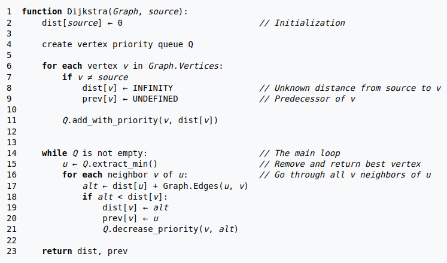
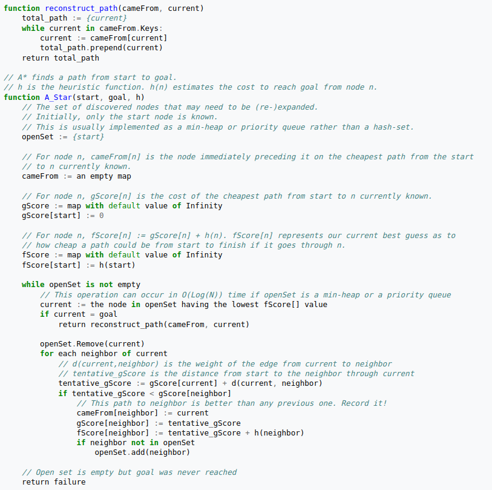

# Motion Planning 

## Overview :

The repository provides Python and MATLAB implementations A* and Dijkstra algorithms. These are popular graph based algorithms which are used in mobile robotics, aiding in pathfinding and navigation tasks.

### Pseudocode for Dijkstra's Algorithm :

### Pseudocode for A* Algorithm :

The following Pseudocodes were used as a reference.

The repository semalessly integrates both Dijkstra's and A* algorithms within a single codebase. The A* implementation is designed to degenerate into Dijkstra's algorithm by adjusting just one parameter. This allows to switch between A* and Dijkstra's algorithm based on the specific needs. 

