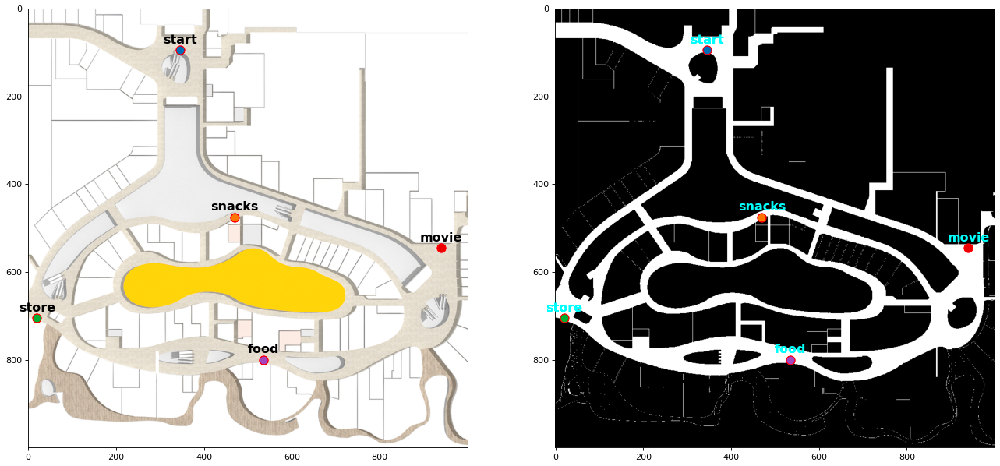
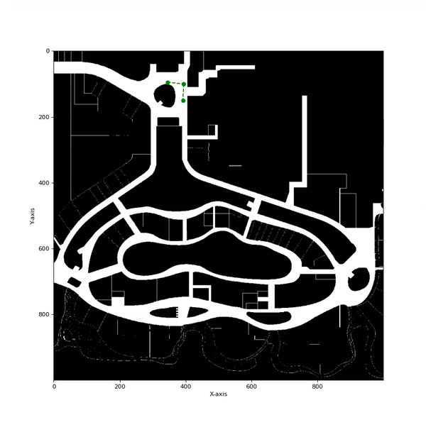

# Path Planning using Rapidly-exploring Random Tree (RRT) algorithm

## Overview :

Rapidly-exploring Random Tree (RRT) algorithm has been implemented in Python. For implementation and testing of both the algorithms, a map of Vivocity Mall Level 2 has been used. The original floor plan provided was converted into a greyscaled grid map which will be used by the planning algorithms. The map has a size of 1000 x 1000 pixels (grid cells), with each cell representing a 0.2m x 0.2m square area. Each grid cell belongs to one of the two possible states: Free (value **255**) or Occupied (value **0**). 

Five key locations have been provided. The goal is to find a path/trajectory between a pair of start and end locations using one of the graph search methods.

**Figure 1:** Original floor plan of Vivocity Level 2 (left). Greysacled grid map of the floor plan (right)

## Usage :

Run the **RRT.py** file to run the sampling based planning algorithm. The five locations along with their coordinates are stored in the dictionary `locations`. Changes can be made to the start and the goal nodes.

## Results:

